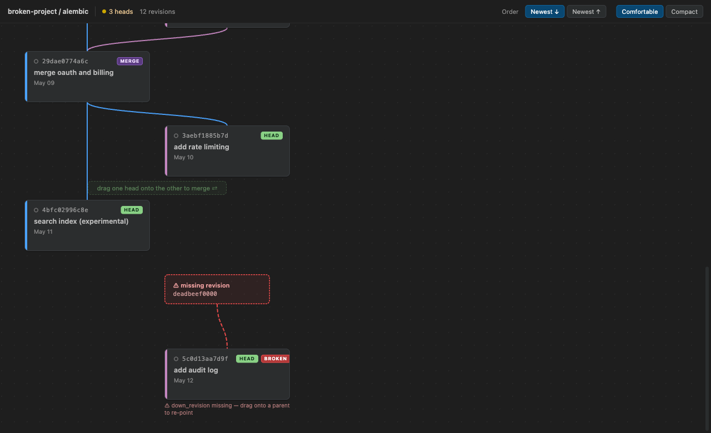

# Alembic Graph

Interactive graph of your [Alembic](https://alembic.sqlalchemy.org/) migration history — see
heads, merges, and broken links at a glance, and fix most of what goes wrong without leaving the
graph.



## Features

- **Graph view** of every revision under `versions/`, laid out by lane/row like a git graph, with
  HEAD / MERGE / BROKEN badges and a dashed-red ghost card for any `down_revision` that points at a
  file that doesn't exist.
- **Horizontal or vertical axis** — the toolbar's **Axis** toggle flips the timeline between a
  left-to-right layout (root left, heads right — the default, so a wide editor tab isn't wasted) and
  the original top-to-bottom layout; **Order** adapts to match (`Newest →`/`Newest ←` horizontal,
  `Newest ↓`/`Newest ↑` vertical).
- **Drag to merge** two heads onto each other to run `alembic merge`, or click **Merge all N
  heads** in the banner (shown once there are 3+ heads) to merge every current head at once — an
  N-way "octopus" merge with a single tuple `down_revision`, exactly like `alembic merge rev1 rev2
  rev3 ...` on the command line; **drag a broken (ghost) link** onto a real revision to repair its
  `down_revision` in place.
- **Blame + one-click Restore/Import for broken links**: a ghost card shows who deleted the missing
  revision and when (with a **Restore** button), or — for a cherry-picked/partial-sync branch where
  the parent was never local — where it can still be found on another ref (with an **Import**
  button), instead of only offering to re-point history.
- **Upgrade / downgrade** to head(s) or to a specific revision, with a confirmation modal and an
  offline **Preview SQL** (`--sql`, never touches the database) before you commit to anything.
- **New revision** from the toolbar (`alembic revision -m ...`).
- **Search, zoom/fit, and keyboard navigation** (arrow keys between cards, Enter to open the file,
  Space to toggle the detail panel, Escape to deselect) — plus hover-to-highlight a revision's full
  ancestry chain.
- **Diagnostics + CodeLens**: broken/duplicate revisions are published to the Problems panel, and
  every `versions/*.py` file gets a "◈ Show in Migration Graph" CodeLens.
- **Export the graph as a standalone SVG** — opens correctly in any browser, no VS Code required.
- **Sidebar view** (activity bar) with a compact heads/current/problems summary and a one-click
  upgrade-to-heads button.
- **Status bar** items for head count (shown when more than one head exists), current revision, and revision count, each opening the graph.
- **Git author + date** shown on every card and in the detail panel, resolved from `git log` in the
  background (never blocks the graph).
- **Multiple Alembic projects**: if your workspace has more than one `alembic.ini`, use **Alembic
  Graph: Select Alembic Project…** to switch between them without reloading the window.

## Requirements

- An Alembic project: an `alembic.ini` whose `script_location` resolves to a directory containing a
  `versions/` folder. The graph itself is built by **statically parsing** those files — no working
  Python environment is required just to view it.
- To run actions that shell out to the real `alembic` CLI (upgrade, downgrade, merge, preview SQL,
  new revision, and the "current revision" badge), you need a Python environment with `alembic`
  installed. Resolution is project-scoped and uses this precedence:
  1. `alembicGraph.alembicCommand`, if set (e.g. `poetry run alembic`).
  2. `alembicGraph.pythonEnvironmentPath`, if set to a virtualenv directory or Python executable.
  3. The [ms-python](https://marketplace.visualstudio.com/items?itemName=ms-python.python)
     extension's active interpreter (`<python> -m alembic`) — installed, but optional; if it's
     absent this step is simply skipped.
  4. A project-local `.venv`/`venv`, auto-discovered under the project's `alembic.ini` directory
     and then its containing workspace folder — this covers the common case of `alembic` installed in
     the project's own virtualenv without it ever being selected as the active Python interpreter.
  5. When the project is a linked Git worktree, `.venv`/`venv` under the corresponding project
     directory and repository root in the main checkout.
  6. A bare `alembic` on `PATH`.

  If none of these resolve to a real `alembic`, the error names exactly what was tried and how to
  fix it (pick an interpreter, install alembic, or set `alembicGraph.alembicCommand`).
- Git, on `PATH`, for author enrichment (optional — cards just show no author if it's missing).

## Linked Git Worktrees

The extension keeps Alembic's working directory in the open worktree, so new migrations and other
file changes stay on the active branch. If that worktree has no local virtualenv, the extension
automatically tries a usable `.venv` or `venv` in the main checkout.

Environment files outside the open worktree are never loaded automatically. Opt in with portable,
resource-scoped settings:

```json
{
  "alembicGraph.environmentFile": "${gitMainProject}/.env",
  "alembicGraph.pythonEnvironmentPath": "${gitMainWorktree}/.venv"
}
```

Paths may be absolute, relative to `alembic.ini`, or use `~`, `${workspaceFolder}`,
`${gitMainWorktree}`, and `${gitMainProject}`. Existing process variables override values from the
configured file. A missing configured file/environment fails before Alembic starts, avoiding an
accidental command against the wrong database. Shared virtualenvs can be unsuitable when the
project was editable-installed from the main checkout; use a worktree-local virtualenv if imports
resolve to main-checkout source.

## Extension Settings

| Setting | Default | Description |
| --- | --- | --- |
| `alembicGraph.laneColorA` | `#4aa3ff` | Color of the trunk lane (lane 0). |
| `alembicGraph.laneColorB` | `#c586c0` | Color of branch lanes (lane 1, and the base color that lanes 2+ hue-rotate from). |
| `alembicGraph.showSqlPreview` | `true` | Show `upgrade()`/`downgrade()` bodies in the revision detail panel. |
| `alembicGraph.alembicCommand` | `""` | Override the alembic executable (default: the selected Python interpreter → `python -m alembic`, else `alembic` on PATH). |
| `alembicGraph.environmentFile` | `""` | Optional `.env` file for Alembic subprocesses; supports portable worktree path tokens. |
| `alembicGraph.pythonEnvironmentPath` | `""` | Optional virtualenv directory or exact Python executable; supports portable worktree path tokens. |
| `alembicGraph.collapseThreshold` | `20` | Minimum run of linear (non-head, non-merge, non-broken) revisions at the root end to collapse into a single placeholder card. |

Changes to any of the above take effect immediately — no reload needed. Runtime paths and
environment files are re-resolved on every Alembic call.

## How it works

The graph is built by **statically parsing** every `versions/*.py` file's docstring and
`revision`/`down_revision`/`branch_labels` assignments — the extension never runs `alembic history`
or imports your migration modules to read the graph, so it works even with a broken or unreachable
database, and even without Python installed at all (though actions need it, see Requirements).

The `alembic` CLI is only ever invoked for **actions** (upgrade, downgrade, merge, revision, SQL
preview) and for the best-effort "what's currently applied" query (`alembic current`) that
decorates cards with a current/applied dot. Any CLI failure — a missing interpreter, an unreachable
database, or a broken revision chain that crashes `alembic` itself — degrades silently to "unknown"
rather than surfacing an error or blocking the graph.

## Known limitations

- Only one project's graph is shown at a time, even if a workspace has several `alembic.ini`
  files — use **Alembic Graph: Select Alembic Project…** to switch. There's no side-by-side or
  multi-project view.
- Author names come from `git log -1 --format=%an` on each revision file, not from Alembic
  itself — a file that isn't tracked in git (or is in a directory git doesn't recognize) simply
  shows no author.
- "Applied"/"current" state is best-effort: it reflects the last successful `alembic current` run
  against whatever database your environment is configured against, and is explicitly `unknown`
  (not "not applied") whenever that command fails or hasn't completed yet.

## License

MIT — see [LICENSE](LICENSE).
